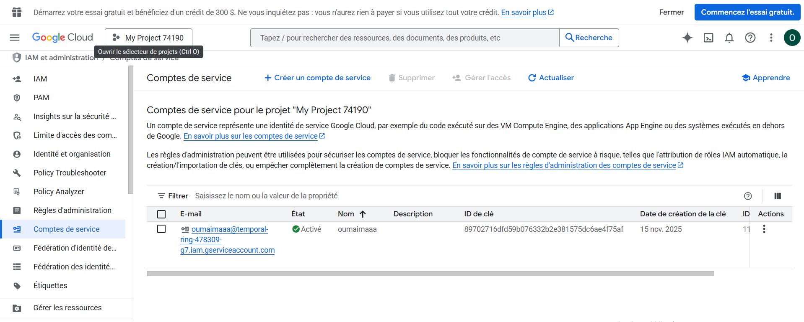
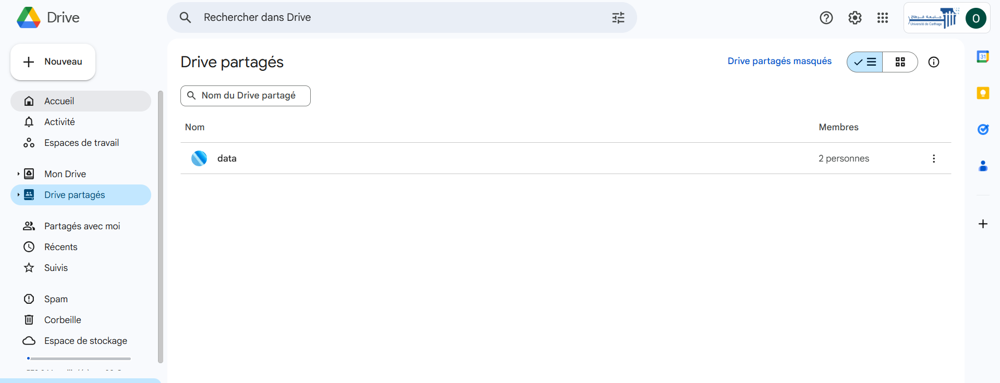
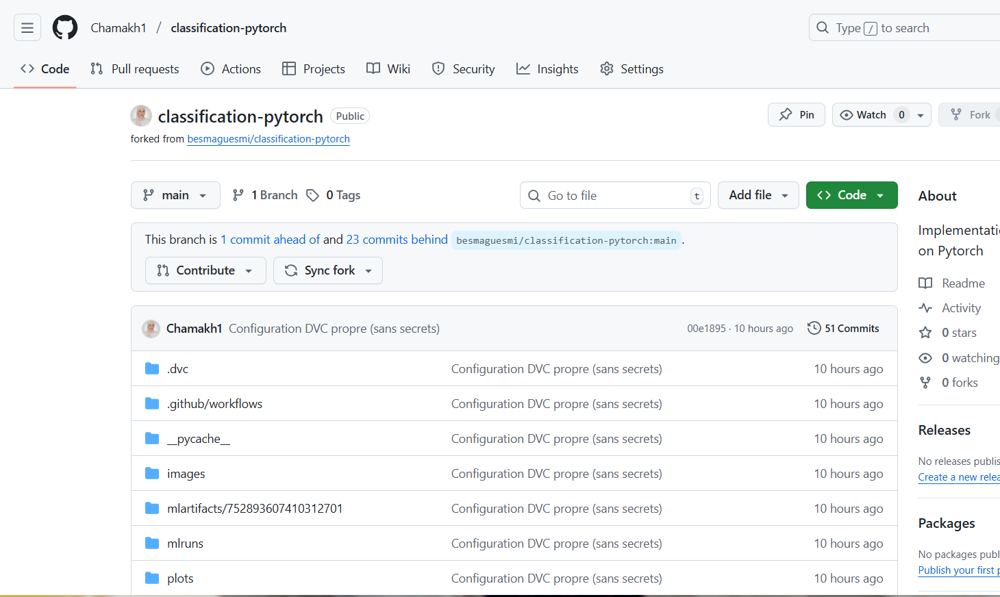
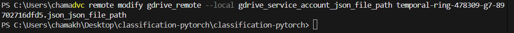
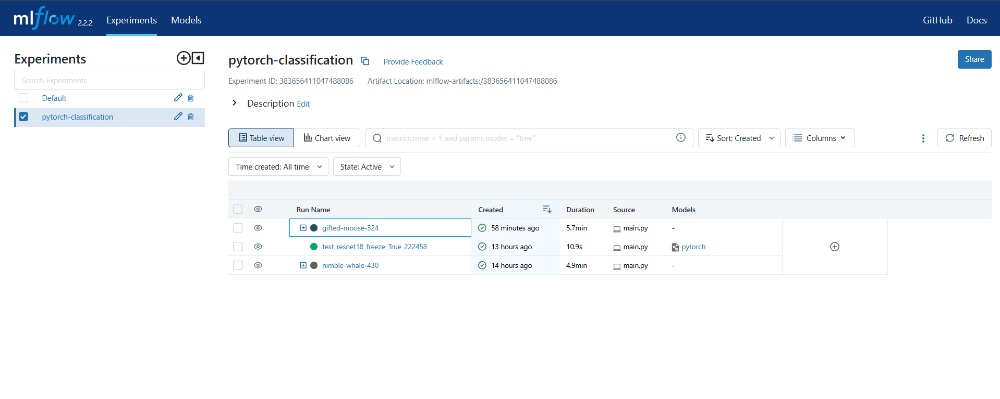

# Rapport Projet Classification PyTorch

Ce document décrit l'ensemble du processus de configuration, préparation des données, suivi des expérimentations et entraînement d'un modèle de classification d'images utilisant PyTorch, DVC et MLflow. Le rapport couvre les étapes de configuration du compte Google Cloud, la préparation du dépôt et du stockage des données, l'intégration de MLflow, ainsi que les analyses détaillées des résultats d'entraînement et de test.

---

## 1. Introduction

Ce projet vise à entraîner un modèle de classification d'images (classes "Mer" et "Forêt") en utilisant un réseau ResNet18. L'approche combine le suivi des expérimentations avec MLflow et la gestion des données et modèles via DVC. Le workflow complet inclut la configuration de l'environnement GCP, l'intégration GitHub Actions, l'initialisation de DVC, l'entraînement avec validation croisée et l'analyse des performances.

---

## 2. Configuration et Préparation de l'Environnement

### 2.1 Accès à la Console GCP et Initialisation

Dans la section **IAM et administration > Comptes de service** de la console Google Cloud.

Le projet actif sélectionné est : **My Project 74190**. Cette interface permet de consulter et gérer tous les comptes de service associés au projet.

J'ai cliqué sur **« + Créer un compte de service »** pour initier la procédure.

**Screenshots:**


### 2.2 Saisie des Informations du Compte de Service

L’assistant de création s’ouvre sur la section **Détails du compte de service**.

* **Nom du compte de service :** `oumaima`
* **ID du compte de service :** généré automatiquement
* **Description :** laissée vide

Après vérification, j'ai cliqué sur **« Créer et continuer »**. Les étapes suivantes (attribution de rôles et gestion des accès) sont facultatives et laissées par défaut.

**Screenshots:**


### 2.3 Confirmation de la Création

Une fois la création validée, la console renvoie vers la liste des comptes de service.

* Notification : **« Compte de service créé »**
* Le compte `oumaima` apparaît dans la liste
* Statut : **Activé**
* Clé : **Aucune clé**

**Screenshots:**


### 2.4 Génération d’une Clé d’Authentification (JSON)

Pour permettre l’utilisation du compte par une application, j'ai créé une clé privée.

Étapes effectuées :

1. Ouvrir le compte `oumaima`
2. Aller dans **Onglet « Clés »**
3. Cliquer sur **« Ajouter une clé » > « Créer une nouvelle clé »**
4. Sélectionner **JSON**
5. Confirmer la création

La clé JSON est automatiquement téléchargée.

**Screenshots:**


### 2.5 Préparation du Dossier Google Drive pour DVC

Créer un dossier dédié aux données du projet sur Google Drive.

* Partager ce dossier avec le compte de service GCP (oumaima) avec rôle Éditeur.
* Enregistrer l’ID du dossier pour la configuration DVC.

**Screenshots:**



### 2.6 Configuration Locale (Local Setup)

#### 2.6.1 Forker le Dépôt GitHub

1. Aller sur [https://github.com/besmaguesmi/classification-pytorch](https://github.com/besmaguesmi/classification-pytorch)
2. Cliquer sur **Fork**.

**Screenshot :**


#### 2.6.2 Installer les Dépendances

```bash
pip install dvc dvc-gdrive
```

**Screenshot :**


#### 2.6.3 Initialiser DVC

```bash
dvc init
```

**Screenshot :**


#### 2.6.4 Ajouter les Données au Suivi DVC

```bash
git rm -r --cached 'data'
git commit -m "stop tracking data"
dvc add data
git add data.dvc
git commit -m "Add dataset and DVC tracking"
```

**Screenshot :**


#### 2.6.5 Configurer le Remote DVC pour Google Drive

```bash
dvc remote add -d gdrive_remote gdrive://FolderID
```

**Screenshot :**


#### 2.6.6 Configurer le Compte de Service Google Drive

```bash
dvc remote modify gdrive_remote gdrive_use_service_account true
```

```bash
dvc remote modify gdrive_remote gdrive_acknowledge_abuse true
```

```bash
dvc remote modify gdrive_remote --local gdrive_service_account_json_file_path data-management-441922-74cd3f254b92.json
```

**Screenshot :**



#### 2.6.7 Activer l’Auto-Staging des fichiers DVC 

```bash
dvc config core.autostage true
```

**Screenshot :**


#### 2.6.8 Gestion des Modèles et Fichiers Lourds

```bash
dvc add models/
git rm -r --cached 'models'
git commit -m "stop tracking models"
```

**Screenshot :**


#### 2.6.9 Pousser les Fichiers DVC vers le Remote

```bash
dvc push
```

**Screenshot :**


### 2.7 GitHub Actions et Gestion des Secrets

#### 2.7.1 Push et Problème GitHub

```bash
git add .dvc/config .gitignore data.dvc
git commit -m "dvc commit"
git push
```

**Erreur :** Push rejeté – secret détecté (clé privée GCP dans l'historique)

**Solution :** Réécriture propre de l'historique Git.

**Commandes :**

```powershell
git reset --soft HEAD~5
git reset HEAD temporal-ring-478309-g7-89702716dfd5.json
Add-Content .gitignore "`ntemporal-ring-478309-g7-89702716dfd5.json"
git add .
git commit -m "Configuration DVC propre (sans secrets)"
git push -f
```

**Screenshots:**


#### 2.7.2 Configuration des Secrets GitHub

Ajouter le secret `GCP_SERVICE_ACCOUNT_KEY` avec le contenu JSON du compte de service dans GitHub Actions.

**Screenshots:**


### 2.8 Installation et Configuration de MLflow

```bash
pip install mlflow
pip install mlflow[pytorch] boto3 psycopg2-binary
```

**Screenshots:**


#### Lancement du Serveur MLflow

```bash
mlflow ui --host 0.0.0.0 --port 5000
```

Interface : [http://localhost:5000](http://localhost:5000)

**Screenshots:**


### 2.9 Synchronisation et Mise à Jour du Code

```powershell
git remote add upstream https://github.com/besmaguesmi/classification-pytorch.git
git fetch upstream
git checkout main
git merge upstream/main
```

#### 2.9.1 Résolution des Conflits de Fusion

**Problème :** Conflits détectés dans `.dvc/config`, `.github/workflows/test.yml`, `main.py`, `train.py`.

**Screenshot :**


#### 2.9.2 Solution : Réinitialisation Forcée

```powershell
git reset --hard upstream/main
```

**Screenshot :**


---

## 4. Entraînement du Modèle avec MLflow

L'entraînement avec suivi MLflow a été lancé avec la commande suivante :

```powershell
python main.py --mode train --data_path data/train --use_mlflow --epochs 5 --freeze False
```

---

### 4.1 Analyse des résultats d'entraînement

#### 4.1.1 Paramètres généraux

* **Device** : CPU
* **Dataset** : 949 images (classes : `sea`, `forest`)
* **Batch size** : 16
* **Époques** : 2
* **MLflow activé** : Oui
* **Backbone** : ResNet18, Freeze = True (couches convolutives pré-entraînées gelées)

#### 4.1.2 Cross-Validation (5-Fold)

Chaque fold a été entraîné avec les logs suivants :

* Taille train/validation : ~759/190 (fold 5 : 760/189)
* Loss et Accuracy enregistrées pour chaque epoch
* Sauvegarde automatique du modèle si **validation loss** diminue
* Enregistrement dans MLflow avec **Model Registry** et création d’une nouvelle version si amélioration

**Exemple Fold 1 :**

| Epoch | Train Loss | Train Acc | Val Loss | Val Acc |
| ----- | ---------- | --------- | -------- | ------- |
| 1     | 0.734793   | 53.1%     | 0.701189 | 55.79%  |
| 2     | 0.693746   | 56.65%    | 0.669861 | 63.68%  |

**Observations :**

* La loss diminue et l’accuracy augmente → le modèle apprend.
* La validation loss diminue également → pas de sur-apprentissage.
* Meilleure performance Fold 1 : 63.68% de validation accuracy.

**Résumé Cross-Validation :**

* **Average best val loss** : 0.714446
* **Average best val accuracy** : 56.59%

**Tableau récapitulatif des folds :**

| Fold | Best Val Loss | Best Val Acc | Epoch |
| ---- | ------------- | ------------ | ----- |
| 1    | 0.669861      | 63.68%       | 2     |
| 2    | 0.707544      | 56.32%       | 2     |
| 3    | 0.793712      | 53.68%       | 2     |
| 4    | 0.730146      | 52.11%       | 2     |
| 5    | 0.670969      | 57.14%       | 2     |

**Screenshot :**


---

### 4.2 Analyse MLflow

#### 4.2.1 Vue d’ensemble - Run Parent

* Le run `gifted-moose-324` regroupe l’ensemble des 5 plis.
* Durée totale : 5.7 minutes.
* Confirme que le tracking MLflow est propre et hiérarchisé.

**Screenshot :**


#### 4.2.2 Runs Enfants

* 5 sous-runs (fold_0 à fold_4) visibles en dépliant le run parent.
* Les modèles sont bien enregistrés → possibilité de recharger n’importe quel modèle.

**Screenshot :**


#### 4.2.3 Comparaison des paramètres

* Tous les paramètres identiques sauf le fold.
* Les différences de performance sont donc dues aux données.

**Screenshot :**


#### 4.2.4 Tableau des scores

* **Gagnant :** Fold 0 → best_val_acc 63.68%, loss 0.67
* **Perdant :** Fold 3 → val_acc 52.11%, loss 0.73
* **Stabilité :** Écart >10% → sous-entraînement ou dataset petit.

**Screenshot :**


#### 4.2.5 Courbes d’Accuracy

* Courbes montent → modèle apprend.
* Fold 0 toujours au-dessus → meilleure performance.
* Courbes non plates → sous-apprentissage, nécessité d’augmenter le nombre d’époques.

**Screenshot :**


#### 4.2.6 Parallel Coordinates Plot

* Toutes les lignes convergent vers l’époque 2 → meilleure performance atteinte à la dernière époque.
* Conclusion : 2 époques insuffisantes, modèle encore améliorable.

**Screenshot :**


#### 4.2.7 Bar Chart - Loss Train vs Val

* Barres élevées (0.7-0.8) → modèle sous-entraîné.
* Peu d’écart train/validation → pas de sur-apprentissage.

**Screenshot :**


---

### 4.3 Ajustements Hyperparamètres et Amélioration

#### 4.3.1 État initial

* 2 époques, learning rate par défaut, pas de régularisation.
* Résultats : précision moyenne ~56%, loss ~0.71 → sous-apprentissage.

#### 4.3.2 Interventions techniques

* Ajout d’arguments dynamiques dans `main.py`.
* Logging MLflow amélioré (epochs, lr, weight_decay).

#### 4.3.3 Nouveaux hyperparamètres

| Paramètre     | Initiale | Nouvelle Valeur | Impact                          |
| ------------- | -------- | --------------- | ------------------------------- |
| Epochs        | 2        | 10              | Temps d’apprentissage suffisant |
| Weight Decay  | 0        | 1e-05           | Régularisation L2 → stabilité   |
| Learning Rate | -        | 1e-05           | Descente de gradient précise    |

---

### 4.4 Résultats finaux

* **Convergence :** Loss finale ~0.015 (début ~0.35)
* **Accuracy moyenne :** ~99% sur tous les plis
* **Stabilité :** Confirmée par Fold 5 (Train: 99.21% / Val: 98.94%)

**Meilleur modèle ("Champion") :** Fold 4 (fold_3 sauvegardé)

* Accuracy : 100%
* Loss : 0.0148

**Screenshot :**


---

### 4.5 Analyse technique MLflow - Captures finales

#### 4.5.1 Convergence

* Lignes convergent vers loss très faible (0.01488 - 0.02800)
* Stabilité remarquable → problème de sous-apprentissage résolu.

**Screenshot :**


#### 4.5.2 Performance

* Validation accuracy : 98.94% - 100%
* Modèle parfaitement généralisé.

**Screenshot :**


#### 4.5.3 Configuration

* Hyperparamètres clés : epochs=10, learning_rate=0.001, backbone=resnet18, freeze_backbone=True
* Garantit la reproductibilité.

**Screenshot :**


---

### 4.6 Résumé

> Le passage à 10 époques a permis de réduire la loss de 0.71 à 0.015 et d’augmenter la précision moyenne de 56% à plus de 99%. Les 5 plis sont stables, confirmant la robustesse du modèle.

---

## 5. Phase de Test et Validation Finale

```powershell
python main.py --mode test --data_path data/test --model_path models/cnn_resnet18_freeze_backbone_True_fold_3.pth --use_mlflow
```

**Statut du Test :** SUCCÈS
**Modèle Évalué :** resnet18_freeze_backbone_True_fold_3.pth

### 5.1 Performance Globale

* Jeu de test inédit : 35 images (15 Mer, 20 Forêt)
* Accuracy : 94.29%
* Taux d’erreur : 5.71%
* Test Loss : 0.0593

**Analyse :** Excellente généralisation, chute minime de ~99% (validation) → 94% (test), pas de sur-apprentissage.

### 5.2 Matrice de Confusion

* Correct : 33/35
* Erreurs : 2 (Forêt confondues avec Mer)

| Classe | Precision | Recall | F1-Score |
| ------ | --------- | ------ | -------- |
| Sea    | 88.2%     | 100%   | 0.937    |
| Forest | 100%      | 90%    | 0.947    |

**Screenshot :**


### 5.3 Visualisation MLflow Test

* Accuracy : 94.29%
* F1-Score : 0.943
* Test Loss : 0.059 → modèle fiable et équilibré

**Screenshot :**

