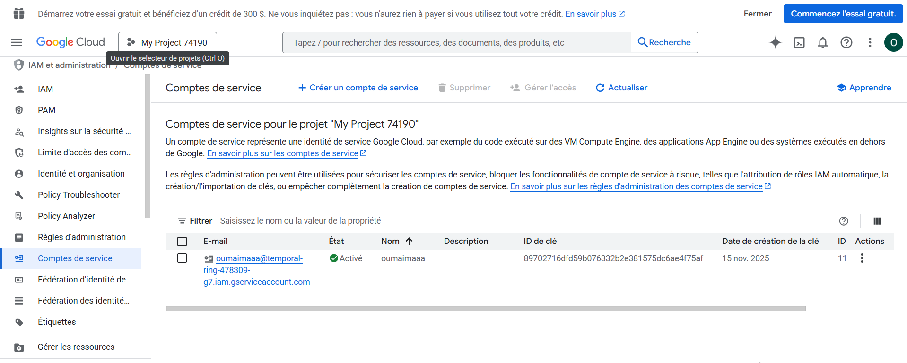
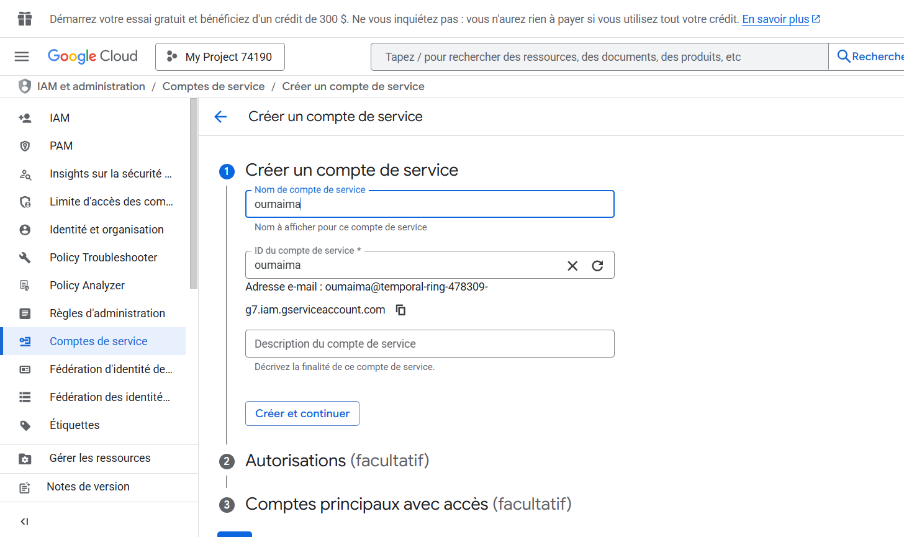

---

## 1. Accès à la Console GCP et Initialisation

Dans la section **IAM et administration > Comptes de service** de la console Google Cloud.

Le projet actif sélectionné est : **My Project 74190**. Cette interface permet de consulter et gérer tous les comptes de service associés au projet.

J'ai clique sur **« + Créer un compte de service »** pour initier la procédure.

**Screenshots:**  
  

---

## 2. Saisie des Informations du Compte de Service

L’assistant de création s’ouvre sur la section **Détails du compte de service**.

Informations renseignées :

- **Nom du compte de service :** `oumaima`
- **ID du compte de service :** généré automatiquement
- **Description :** laissée vide

Après vérification, j'ai cliqueé sur **« Créer et continuer »**.

Les étapes suivantes (attribution de rôles et gestion des accès) sont facultatives et laissées par défaut.

**Screenshots:**  
 

---

## 3. Confirmation de la Création

Une fois la création validée, la console renvoie vers la liste des comptes de service.

Éléments observés :

- Notification : **« Compte de service créé »**
- Le compte `oumaima` apparaît dans la liste
- Statut : **Activé**
- Clé : **Aucune clé** 

**Screenshots:**  
 
---

## 4. Génération d’une Clé d’Authentification (JSON)

Pour permettre l’utilisation du compte par une application, j'ai  créer une clé privée.

Étapes effectuées :

1. Ouvrir le compte `oumaima`
2. Aller dans **Onglet « Clés »**
3. Cliquer sur **« Ajouter une clé » > « Créer une nouvelle clé »**
4. Sélectionner **JSON**
5. Confirmer la création

Google rappelle que la clé téléchargée est unique et ne pourra pas être récupérée en cas de perte.

Après validation, la clé JSON est automatiquement téléchargée.

**Screenshots:**  
 

---

## 5. Résultat Final

À la fin de cette procédure, l’utilisateur dispose :

- d’un **compte de service nommé `oumaima`** ;
- d’un **fichier clé JSON** associé, indispensable pour l’authentification dans les applications utilisant les services Google Cloud.

La clé peut être exploitée dans un code via la variable d’environnement :

